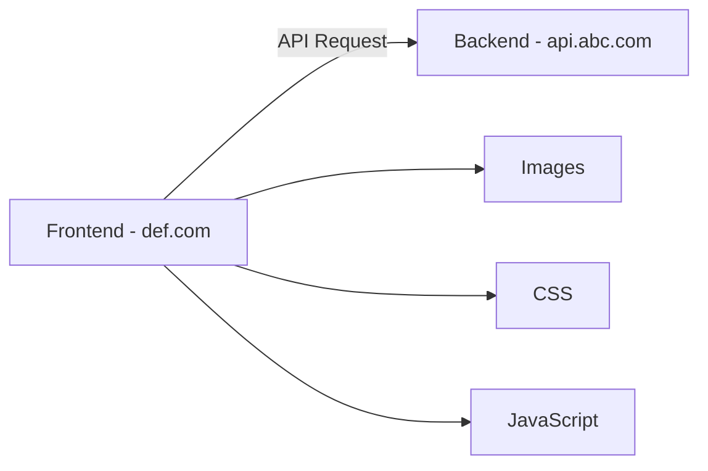
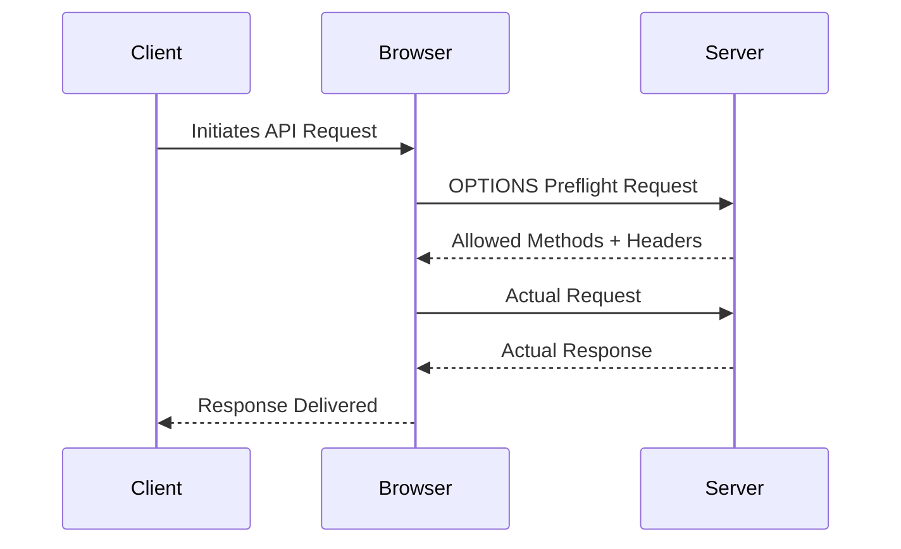
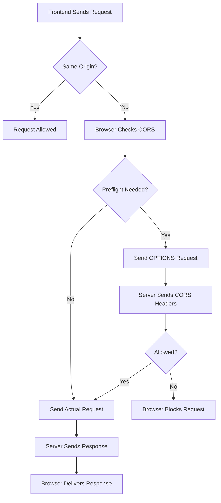

# CORS (Cross-Origin Resource Sharing) – Detailed Notes

## What is CORS?

CORS (Cross-Origin Resource Sharing) is a browser security mechanism that allows or restricts resources requested from another origin outside the current origin.

It is built on top of the **Same-Origin Policy (SOP)**.

---

# Same-Origin Policy (SOP)

Same-Origin Policy is a browser security feature that prevents one website from accessing resources of another website unless explicitly allowed.

Two URLs are considered the **same origin** only if all three are same:

1. Protocol
2. Domain
3. Port

---

## Origin Structure

```txt
protocol://domain:port
```

Example:

```txt
https://example.com:443
```

- Protocol → https
- Domain → example.com
- Port → 443

---

# Cross-Origin Examples

| Origin 1 | Origin 2 | Same Origin? | Reason |
|---|---|---|---|
| http://localhost:4000 | http://localhost:4001 | ❌ No | Different Port |
| http://a.com | https://a.com | ❌ No | Different Protocol |
| http://a.com | http://sub.a.com | ❌ No | Different Subdomain |
| https://abc.com | https://abc.com | ✅ Yes | Everything Same |

---

# Basic CORS Architecture



---

# Why CORS Exists

Without CORS, malicious websites could steal sensitive user data such as:

- Banking details
- Session cookies
- Personal information
- Authenticated API responses

CORS ensures the server explicitly decides who can access its resources.

---

# How Browser Handles Cross-Origin Requests

When frontend tries to call another origin:

```js
fetch("https://api.example.com/users")
```

Browser checks:

1. Is this same-origin?
2. If cross-origin:
   - Check CORS rules
   - Send preflight request if needed
   - Verify response headers

---

# Important CORS Headers

## 1. Access-Control-Allow-Origin

Defines which origin can access the resource.

```http
Access-Control-Allow-Origin: http://localhost:3000
```

Allow all origins:

```http
Access-Control-Allow-Origin: *
```

⚠ Never use `*` with credentials.

---

## 2. Access-Control-Allow-Methods

Defines allowed HTTP methods.

```http
Access-Control-Allow-Methods: GET, POST, PUT, DELETE
```

---

## 3. Access-Control-Allow-Headers

Defines allowed request headers.

```http
Access-Control-Allow-Headers: Content-Type, Authorization
```

---

## 4. Access-Control-Allow-Credentials

Allows cookies/auth headers.

```http
Access-Control-Allow-Credentials: true
```

Used when frontend sends:

```js
credentials: "include"
```

---

## 5. Access-Control-Expose-Headers

Allows frontend JavaScript to read specific response headers.

```http
Access-Control-Expose-Headers: X-Token
```

---

# Simple Request vs Preflight Request

## Simple Request

A request is simple if:

- Method is GET, POST, HEAD
- Uses safe headers
- Uses safe content types

Example:

```js
fetch("https://api.example.com/users")
```

Browser directly sends request.

---

# Preflight Request

Browser sends an OPTIONS request before actual request.

Purpose:
- Ask server permission
- Validate headers/methods

---

# Preflight Flow Diagram



---

# Example of Preflight Request

## Browser Sends

```http
OPTIONS /users HTTP/1.1
Origin: http://localhost:3000
Access-Control-Request-Method: PUT
Access-Control-Request-Headers: Authorization
```

---

## Server Responds

```http
HTTP/1.1 204 No Content
Access-Control-Allow-Origin: http://localhost:3000
Access-Control-Allow-Methods: GET, POST, PUT
Access-Control-Allow-Headers: Authorization
```

If allowed:
✅ Browser sends actual request.

If denied:
❌ Browser blocks request.

---

# Real-World Example

Frontend:

```txt
http://localhost:3000
```

Backend:

```txt
http://localhost:5000
```

Since ports differ:
➡ Cross-Origin Request

Browser requires CORS headers from backend.

---

# Express.js CORS Setup

Install package:

```bash
npm install cors
```

---

## Basic Setup

```js
import express from "express";
import cors from "cors";

const app = express();

app.use(cors());

app.get("/", (req, res) => {
  res.json({ message: "CORS enabled" });
});

app.listen(5000);
```

---

# Restrict Specific Origins

```js
app.use(
  cors({
    origin: "http://localhost:3000"
  })
);
```

---

# Allow Credentials

```js
app.use(
  cors({
    origin: "http://localhost:3000",
    credentials: true
  })
);
```

Frontend:

```js
fetch("http://localhost:5000/users", {
  credentials: "include"
});
```

---

# Manual CORS Setup Without Package

```js
app.use((req, res, next) => {
  res.header("Access-Control-Allow-Origin", "http://localhost:3000");
  res.header(
    "Access-Control-Allow-Methods",
    "GET,POST,PUT,DELETE"
  );
  res.header(
    "Access-Control-Allow-Headers",
    "Content-Type,Authorization"
  );

  next();
});
```

---

# CORS Request Lifecycle



---

# Common CORS Errors

## Error 1

```txt
Access to fetch at ... has been blocked by CORS policy
```

Cause:
- Missing `Access-Control-Allow-Origin`

---

## Error 2

```txt
Response to preflight request doesn't pass access control check
```

Cause:
- Missing methods/headers

---

## Error 3

```txt
Credential is not supported if the CORS header is '*'
```

Cause:
- Using wildcard with credentials

Wrong:

```http
Access-Control-Allow-Origin: *
Access-Control-Allow-Credentials: true
```

Correct:

```http
Access-Control-Allow-Origin: http://localhost:3000
Access-Control-Allow-Credentials: true
```

---

# Security Best Practices

## ❌ Avoid

```http
Access-Control-Allow-Origin: *
```

for sensitive APIs.

---

## ✅ Prefer

```http
Access-Control-Allow-Origin: https://yourfrontend.com
```

---

# Production Recommendations

- Allow only trusted origins
- Avoid wildcard origins
- Use HTTPS
- Validate authorization properly
- Limit allowed methods
- Restrict allowed headers

---

# Important Interview Questions

## What is SOP?

Same-Origin Policy prevents websites from accessing data from another origin.

---

## What is CORS?

CORS is a mechanism that allows controlled cross-origin access.

---

## Why is preflight request needed?

To verify whether server allows the actual request.

---

## Which request method is used in preflight?

```txt
OPTIONS
```

---

## Does CORS protect backend server?

No.

CORS is enforced by browsers, not backend servers.

Tools like Postman ignore CORS.

---

# CORS vs Authentication

| CORS | Authentication |
|---|---|
| Browser Security Feature | User Verification |
| Controls Origins | Controls Users |
| Enforced by Browser | Enforced by Server |

---

# Important Point

CORS errors are browser-side restrictions.

Server may successfully process request, but browser blocks frontend from reading response.

---

# Final Summary

- SOP blocks cross-origin access by default
- CORS allows controlled access
- Browser validates CORS headers
- Preflight requests use OPTIONS
- Backend must explicitly allow origins
- CORS improves web security

---

# Quick Revision

```txt
SOP -> Restricts Cross-Origin Requests

CORS -> Allows Controlled Cross-Origin Requests

Origin = Protocol + Domain + Port

Preflight = OPTIONS Request

Important Headers:
- Access-Control-Allow-Origin
- Access-Control-Allow-Methods
- Access-Control-Allow-Headers
- Access-Control-Allow-Credentials
```
