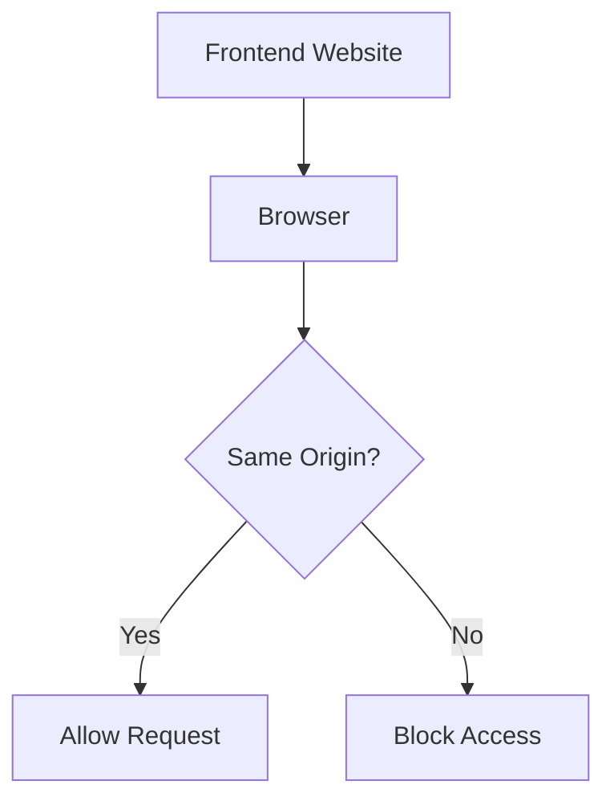
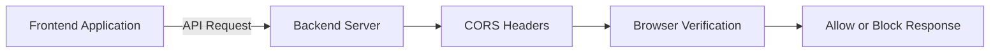
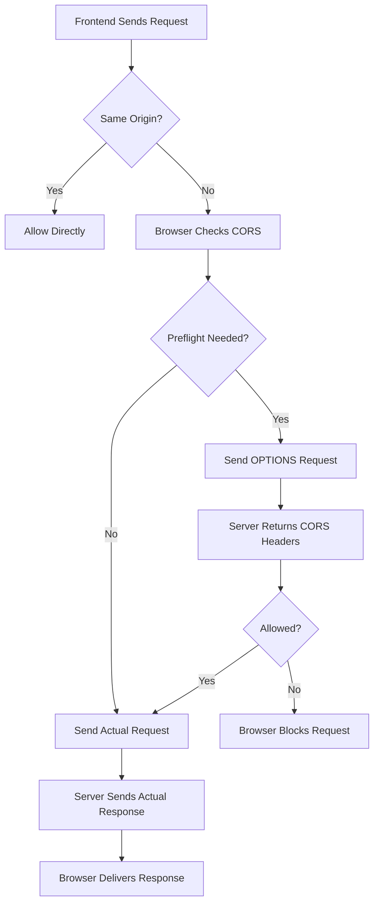
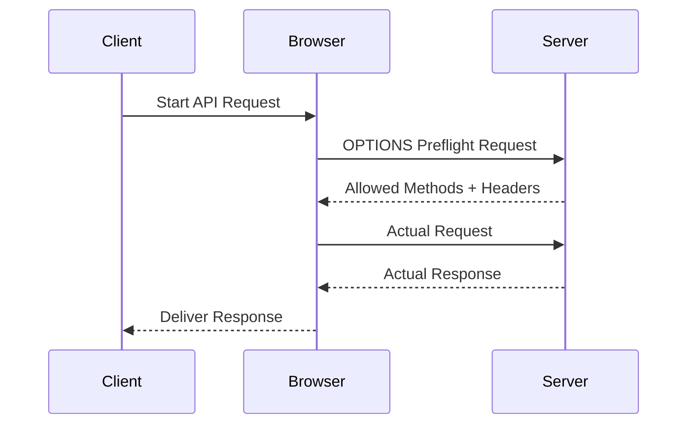

# Complete CORS (Cross-Origin Resource Sharing) Notes

# Introduction

CORS stands for:

```txt
Cross-Origin Resource Sharing
```

CORS is a browser security mechanism that allows controlled access to resources located on another origin.

It works together with the Same-Origin Policy (SOP).

---

# What is an Origin?

An origin is made up of 3 parts:

```txt
Protocol + Domain + Port
```

Example:

```txt
https://example.com:443
```

| Part | Value |
|---|---|
| Protocol | https |
| Domain | example.com |
| Port | 443 |

---

# Important Point

Path is NOT part of origin comparison.

Example:

```txt
https://example.com/users
https://example.com/products
```

These are same-origin because protocol, domain, and port are same.

---

# Same-Origin Policy (SOP)

SOP is a browser security feature.

It prevents one website from reading resources from another website.

---

# Why SOP Exists

Without SOP:

- Any website could access banking websites
- Malicious websites could steal cookies
- User sessions could be hijacked
- Sensitive APIs could be abused

SOP protects users from unauthorized access.

---

# SOP Flowchart



---

# Cross-Origin Request

A request becomes cross-origin if ANY of these change:

- Protocol
- Port
- Subdomain

---

# Cross-Origin Examples

| URL 1 | URL 2 | Cross-Origin? | Reason |
|---|---|---|---|
| http://localhost:3000 | http://localhost:5000 | Yes | Different Port |
| http://a.com | https://a.com | Yes | Different Protocol |
| http://a.com | http://api.a.com | Yes | Different Subdomain |
| https://abc.com | https://abc.com | No | Same Everything |

---

# Real Example

Frontend:

```txt
http://localhost:3000
```

Backend:

```txt
http://localhost:5000
```

Ports differ.

Therefore:
➡ Cross-Origin Request

---

# Problem Without CORS

Imagine:

```txt
evil.com
```

tries to access:

```txt
bank.com/api/user-data
```

Without protection:
❌ Sensitive data could leak.

Browser blocks this using SOP.

---

# How CORS Solves This

CORS allows server to explicitly say:

✅ "This origin is allowed."

Server sends special headers.

Browser checks those headers.

---

# Basic CORS Architecture



---

# CORS Request Lifecycle



---

# Important CORS Headers

# 1. Access-Control-Allow-Origin

Defines which frontend can access backend.

Example:

```http
Access-Control-Allow-Origin: http://localhost:3000
```

Allow all origins:

```http
Access-Control-Allow-Origin: *
```

⚠ Avoid wildcard in production.

---

# 2. Access-Control-Allow-Methods

Defines allowed HTTP methods.

Example:

```http
Access-Control-Allow-Methods: GET, POST, PUT, DELETE
```

---

# 3. Access-Control-Allow-Headers

Defines allowed request headers.

Example:

```http
Access-Control-Allow-Headers: Authorization, Content-Type
```

---

# 4. Access-Control-Allow-Credentials

Allows cookies/session authentication.

Example:

```http
Access-Control-Allow-Credentials: true
```

Frontend:

```js
fetch("http://localhost:5000", {
  credentials: "include"
});
```

⚠ Cannot use wildcard origin with credentials.

Wrong:

```http
Access-Control-Allow-Origin: *
Access-Control-Allow-Credentials: true
```

Correct:

```http
Access-Control-Allow-Origin: http://localhost:3000
Access-Control-Allow-Credentials: true
```

---

# 5. Access-Control-Expose-Headers

Allows frontend JavaScript to read specific headers.

Example:

```http
Access-Control-Expose-Headers: X-Token
```

---

# Simple Requests

A request is considered simple if:

- Method is GET, POST, HEAD
- No custom headers
- Safe content type

Example:

```js
fetch("https://api.example.com/users")
```

Browser directly sends request.

---

# Preflight Requests

Before dangerous requests, browser sends:

```txt
OPTIONS
```

request first.

Purpose:
- Ask permission
- Validate methods
- Validate headers

---

# When Preflight Happens

Preflight usually happens when:

- Using PUT/PATCH/DELETE
- Sending Authorization header
- Sending custom headers
- Using non-standard content type

---

# Preflight Request Flowchart



---

# Example of Preflight Request

# Browser Sends

```http
OPTIONS /users HTTP/1.1
Origin: http://localhost:3000
Access-Control-Request-Method: PUT
Access-Control-Request-Headers: Authorization
```

---

# Server Responds

```http
HTTP/1.1 204 No Content

Access-Control-Allow-Origin: http://localhost:3000

Access-Control-Allow-Methods: GET, POST, PUT

Access-Control-Allow-Headers: Authorization
```

If allowed:
✅ Browser sends actual request.

If denied:
❌ Browser blocks request.

---

# Browser Role in CORS

Important:

CORS is enforced by browsers.

Postman does NOT enforce CORS.

This means:
- Backend may respond successfully
- Browser may still block frontend access

---

# Express.js CORS Setup

# Install

```bash
npm install cors
```

---

# Basic Setup

```js
import express from "express";
import cors from "cors";

const app = express();

app.use(cors());

app.listen(5000);
```

---

# Restrict Specific Origin

```js
app.use(
  cors({
    origin: "http://localhost:3000"
  })
);
```

---

# Allow Credentials

```js
app.use(
  cors({
    origin: "http://localhost:3000",
    credentials: true
  })
);
```

---

# Manual CORS Setup

```js
app.use((req, res, next) => {

  res.header(
    "Access-Control-Allow-Origin",
    "http://localhost:3000"
  );

  res.header(
    "Access-Control-Allow-Methods",
    "GET,POST,PUT,DELETE"
  );

  res.header(
    "Access-Control-Allow-Headers",
    "Content-Type,Authorization"
  );

  next();
});
```

---

# Common CORS Errors

# Error 1

```txt
Access to fetch has been blocked by CORS policy
```

Cause:
- Missing Allow-Origin header

---

# Error 2

```txt
Response to preflight request doesn't pass access control check
```

Cause:
- Missing methods or headers

---

# Error 3

```txt
Credential is not supported if CORS header is '*'
```

Cause:
- Wildcard origin with credentials

---

# Security Best Practices

✅ Allow only trusted origins

✅ Use HTTPS

✅ Avoid wildcard origins

✅ Restrict methods

✅ Restrict headers

✅ Validate authentication separately

---

# CORS vs Authentication

| CORS | Authentication |
|---|---|
| Browser Security | User Verification |
| Controls Origins | Controls Users |
| Enforced by Browser | Enforced by Backend |

---

# Important Interview Questions

# What is SOP?

Same-Origin Policy prevents websites from accessing data from another origin.

---

# What is CORS?

CORS is a mechanism that allows controlled cross-origin access.

---

# Why is preflight request needed?

To check whether server allows actual request.

---

# Which method is used in preflight?

```txt
OPTIONS
```

---

# Does CORS secure backend?

❌ No.

CORS only protects browsers.

---

# Final Summary

```txt
Origin = Protocol + Domain + Port

SOP blocks cross-origin requests by default.

CORS allows controlled cross-origin access.

Preflight requests use OPTIONS method.

Browser validates CORS headers before allowing access.
```
