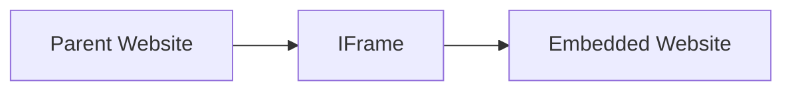
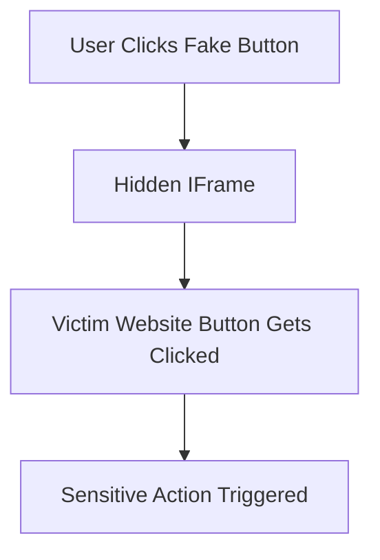
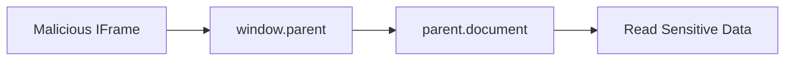
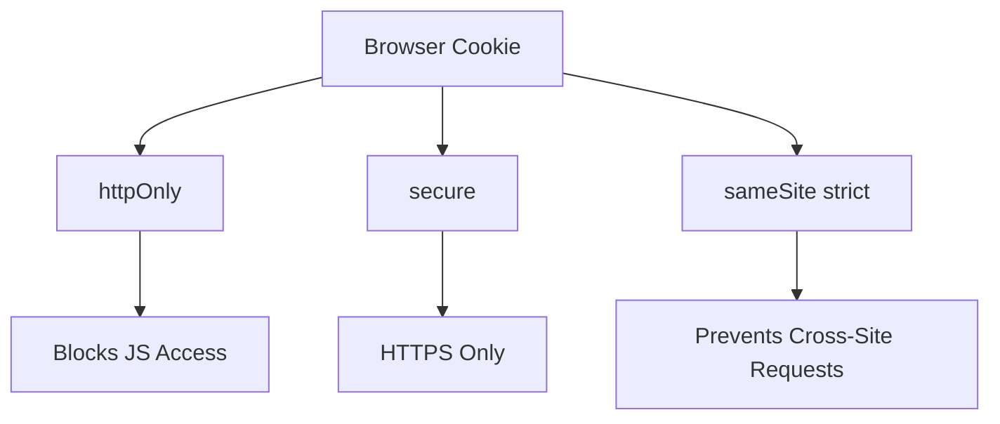
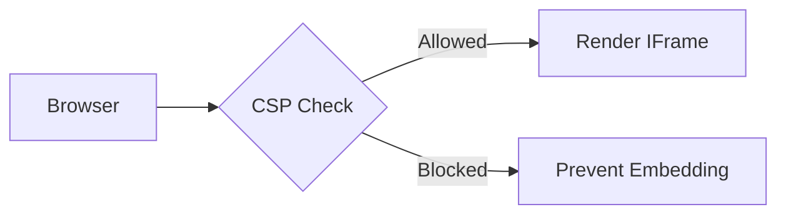

# IFrame Protection

> Notes and practical learning about iframe security, clickjacking, cookie theft, CSP, and browser protections.

---

# What is an IFrame?

An `<iframe>` allows one website to embed another website inside it.

Example:

```html
<iframe src="https://example.com"></iframe>
```

Think of it like:

- A website inside another website
- A mini browser window embedded into a page

---

# Basic Architecture



---

# Why are IFrames Dangerous?

If used incorrectly, attackers can:

- Trick users into clicking hidden buttons
- Steal session or cookie information
- Run malicious JavaScript
- Overlay fake UI elements
- Perform phishing attacks

---

# Common Vulnerabilities

# 1. Clickjacking

## What is Clickjacking?

Clickjacking happens when an attacker places your website inside a hidden iframe and tricks users into clicking something they never intended to click.

Example:

- User thinks they are clicking:
  - "Play Video"

But actually clicks:

- "Transfer Money"
- "Delete Account"
- "Allow Camera"

---

# Clickjacking Diagram



---

# Vulnerable Website Example

```html
<button id="overlay-button">Click Me!</button>

<script>
document
  .getElementById("overlay-button")
  .addEventListener("click", () => {
      alert("Button clicked!");
  });
</script>
```

---

# Malicious Website

```html
<iframe
  src="http://localhost:5011/iframe-website1"
></iframe>
```

The attacker embeds the victim site inside an iframe and overlays UI elements.

---

# 2. Data Theft via JavaScript

A malicious iframe may try accessing data from the parent window.

Example:

```js
const parentWindow = window.parent;
const parentDocument = parentWindow.document;

const stolenData = parentDocument.innerHTML;
```

The attacker tries reading:

- HTML
- Tokens
- Sensitive information
- User data

---

# Data Theft Flow



---

# Example Malicious IFrame

```html
<!DOCTYPE html>
<html>

<head>
    <title>Malicious iframe</title>
</head>

<body>

    <h1>Malicious iframe</h1>

    <p>
        This iframe attempts to steal data from the parent window.
    </p>

    <script>
        window.onload = function () {

            try {
                const parentWindow = window.parent;
                const parentDocument = parentWindow.document;

                const stolenData = parentDocument.innerHTML;

                alert("Stolen Data: " + stolenData);

            } catch (error) {

                console.error("Data theft failed:", error);
            }
        };
    </script>

</body>

</html>
```

---

# 3. Session & Cookie Theft

Attackers may attempt to steal cookies using JavaScript.

Example:

```js
document.cookie
```

If cookies are not protected:

- Session hijacking can happen
- Attackers can impersonate users

---

# Cookie Security

## Secure Cookie Example

```js
res.cookie('sessionID', '12345', {
    httpOnly: true,
    secure: true,
    sameSite: 'strict',
});
```

---

# Meaning of Cookie Flags

| Option | Purpose |
|---|---|
| `httpOnly` | Prevents JavaScript access |
| `secure` | Sends cookie only over HTTPS |
| `sameSite` | Prevents cross-site abuse |

---

# Cookie Protection Diagram



---

# IFrame Protection Techniques

# 1. X-Frame-Options

Old but widely supported protection header.

## DENY

```http
X-Frame-Options: DENY
```

No website can embed your page.

---

## SAMEORIGIN

```http
X-Frame-Options: SAMEORIGIN
```

Only your own domain can iframe your content.

---

# Express Example

```js
app.use((req, res, next) => {

    res.setHeader(
        "X-Frame-Options",
        "DENY"
    );

    next();
});
```

---

# 2. Content Security Policy (CSP)

Modern and recommended solution.

## frame-ancestors

Controls who can embed your website.

---

# CSP Example

```js
app.use((req, res, next) => {

    res.setHeader(
        'Content-Security-Policy',
        "frame-ancestors 'self'"
    );

    next();
});
```

---

# Block All IFrames

```js
"frame-ancestors 'none'"
```

Nobody can embed your website.

---

# CSP Diagram



---

# 3. Sandbox Attribute

Restricts iframe capabilities.

Example:

```html
<iframe
  src="https://example.com"
  sandbox
></iframe>
```

---

# Sandbox Restrictions

Without permissions:

- No forms
- No scripts
- No popups
- No top navigation

---

# Allow Specific Features

```html
<iframe
  sandbox="allow-scripts allow-forms"
></iframe>
```

---

# Same-Origin Policy (SOP)

Browsers block many iframe attacks using SOP.

Two websites are same-origin only if they have:

- Same protocol
- Same domain
- Same port

---

# SOP Examples

| URL Comparison | Same Origin? |
|---|---|
| `https://google.com` vs `https://google.com` | ✅ |
| `http://google.com` vs `https://google.com` | ❌ |
| `localhost:3000` vs `localhost:5011` | ❌ |

---

# Why Your Attack Failed

In your demo:

```js
const parentDocument = parentWindow.document;
```

Modern browsers usually block this if origins are different.

Example browser error:

```txt
Blocked a frame with origin from accessing a cross-origin frame.
```

This is browser security working correctly.

---

# Full Protection Middleware

```js
app.use((req, res, next) => {

    res.setHeader(
        'Content-Security-Policy',
        "frame-ancestors 'none'"
    );

    res.cookie('sessionID', '12345', {
        httpOnly: true,
        secure: true,
        sameSite: 'strict',
    });

    next();
});
```

---

# Real World Uses of IFrames

IFrames are commonly used in:

- YouTube embeds
- Payment gateways
- Advertisements
- Google Maps
- Authentication popups

Because they are powerful, they must be secured carefully.

---

# Best Practices

Always:

- Use CSP headers
- Use X-Frame-Options
- Protect cookies
- Use HTTPS
- Use sandboxed iframes
- Validate embedded content

---

# Final Summary

## Vulnerabilities

- Clickjacking
- Data theft via JavaScript
- Session hijacking
- Cookie theft

---

## Protection Techniques

- `X-Frame-Options`
- `Content-Security-Policy`
- `sandbox`
- `httpOnly`
- `secure`
- `sameSite`
- Same-Origin Policy

---

# Quick Revision Table

| Concept | Purpose |
|---|---|
| iframe | Embed another webpage |
| Clickjacking | Trick user clicks |
| CSP frame-ancestors | Control iframe embedding |
| X-Frame-Options | Prevent iframe usage |
| sandbox | Restrict iframe powers |
| httpOnly | Block JS cookie access |
| secure | HTTPS-only cookies |
| sameSite | Prevent cross-site cookie abuse |

